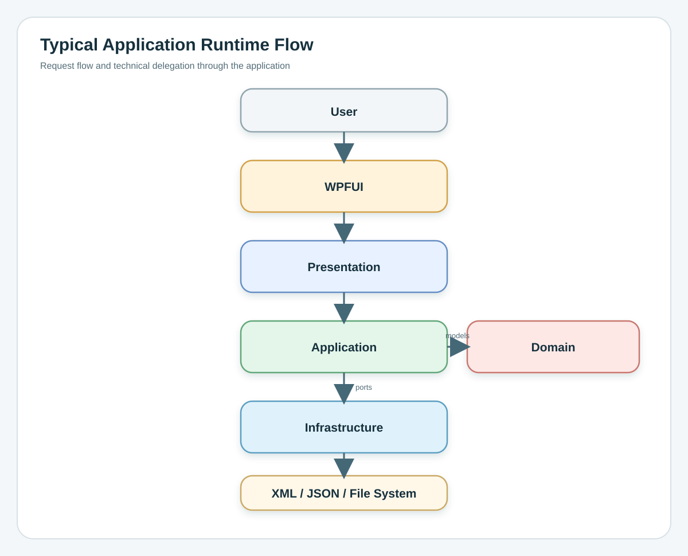
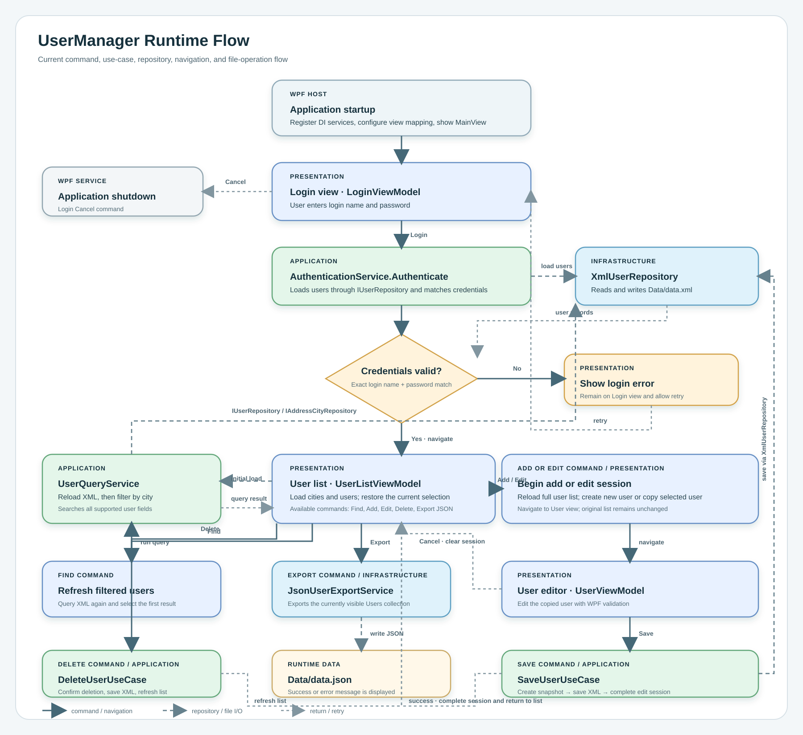

# Architektúra

[English version](architecture.md) · [Receptgyűjtemény](cookbook/README_HU.md) · [Architekturális döntési napló](decisions/README_HU.md)

A UserManager repository nem product documentation site-nak készült. Elsősorban MVVM és layered architecture referenciaimplementáció, valamint hosszú távú személyes tudásbázis, amely új WPF projektek indítása előtt újra elővehető.

Az angol és magyar architektúra dokumentum tartalmilag szinkronban tartandó. Egyik nyelvi változat sem rövidített verziója a másiknak.

Ez a dokumentum a repository központi architektúra-kézikönyve. Úgy érdemes olvasni, mint egy kisebb technikai könyvet: elejétől a végéig. A cél az, hogy egy fejlesztő több különálló architektúra oldal megnyitása nélkül megértse az architekturális filozófiát, az MVVM mappinget, a Clean Architecture ihletésű rétegezést, a dependency szabályokat, a runtime flow-t, a Dependency Injection felépítését és az egyes modulok szerepét.

## Bevezetés

A UserManager egy kis WPF alkalmazás, amely user authentication, user management, XML persistence és JSON export funkciókat tartalmaz. Az alkalmazás három képernyőből áll:

- Login: a user hitelesítése az XML adatfájl alapján.
- User List: felhasználók megjelenítése, város szerinti szűrés, keresés, hozzáadás, szerkesztés, törlés és export.
- User Editor: minden mező szerkesztése a `UserId` kivételével, input validation megjelenítése, valamint tranzakcionális Save / Cancel workflow.

A minta szándékosan kicsi, de a struktúra úgy van kialakítva, hogy nagyobb alkalmazások felé is skálázható legyen. Bemutatja a modern MVVM architektúrát, a Dependency Injection használatát, a Repository patternt, az Application Use Case-eket, a tranzakcionális szerkesztést, valamint a presentation, business behavior és persistence tiszta szétválasztását.

A fő projektek:

- `FW4di.Dotnet.Core`
- `FW4di.Dotnet.MVVM`
- `App4di.Dotnet.UserManager.Domain`
- `App4di.Dotnet.UserManager.Application`
- `App4di.Dotnet.UserManager.Infrastructure`
- `App4di.Dotnet.UserManager.Presentation`
- `App4di.Dotnet.UserManager.WPFUI`
- `App4di.Dotnet.UserManager.Tests`

A projekt MVVM, Clean Architecture, Clean Code és SOLID elvekből kiinduló, gyakorlati layered architecture-t követ, miközben tudatosan kerüli a felesleges enterprise bonyolítást.

## Architekturális filozófia

Az architektúra néhány tudatos célra épül:

- A felelősségek tiszta szétválasztása.
- Az üzleti logika legyen független a WPF-től.
- Az üzleti logika legyen független a persistence technológiától.
- Dependency inversion Application contractokon keresztül.
- Vékony ViewModelek, amelyek presentation state és UI orchestration feladatokra korlátozódnak.
- Az Infrastructure technikai implementációkat tartalmazzon, ne business policy-t.
- Magas testability Dependency Injection és fókuszált service-ek használatával.
- Az újrahasznosítható framework code legyen elkülönítve az application-specific behaviortól.

A cél nem a projektek, classok, interface-ek vagy patternek számának maximalizálása. A cél az, hogy a felelősségek explicit módon jelenjenek meg, a dependencyk kontrolláltak legyenek, a behavior tesztelhető maradjon, és a jövőbeli változások lokálisak legyenek, ne terjedjenek szét a teljes codebase-ben.

Ezért a repository annyi struktúrát használ, amennyi az architekturális határok bemutatásához kell, de nem alakítja a mintát általános frameworkké. A Clean Architecture iránymutatásként jelenik meg, nem merev ceremóniaként. Az MVVM ott jelenik meg, ahol WPF-ben természetes: a XAML View-k ViewModelekhez bindolnak, a ViewModelek state-et és commandokat tesznek közzé, az application behavior pedig a konkrét UI-n kívül marad.

A Microsoft Learn, Martin Fowler Presentation Model leírása és Robert C. Martin Clean Architecture írása hasonló irányba mutat: a UI concernöket érdemes elkülöníteni a non-UI behaviortól, binding és command használatával lazítani kell a View és presentation logic közti kapcsolatot, a dependencyk legyenek explicitek, a source dependencyk pedig a stabil business policy felé mutassanak, ne a változékony technikai részletek felé.

## MVVM

Az MVVM három együttműködő szerepre osztja a presentation-orientált szoftvert: Model, View és ViewModel.

```text
User interaction
      |
      v
+-----------+     binding / commands     +-------------+     use cases / services     +-----------+
|   View    | --------------------------> |  ViewModel  | ---------------------------> |  Model    |
|  XAML UI  | <-------------------------- | UI state    | <--------------------------- | behavior  |
+-----------+     property changes        +-------------+     results / data           +-----------+
```

A View a konkrét felhasználói felület. WPF-ben ez XAML-t, visual layoutot, controlokat, style-okat, template-eket, resource-okat, validation visualokat, convertereket és valóban view-specific code-behindot jelent.

A ViewModel presentation model. Olyan formában tesz közzé state-et és actionöket, amelyet a WPF data binding fel tud használni anélkül, hogy konkrét controlokat ismerne. A ViewModel koordinálja a user intentet, commandokat, selectiont, loading state-et, validation message-eket, navigationt, dialogokat, és application service-eket vagy use case-eket hív.

A Model tágabb fogalom, mint egy DTO vagy database record. Ide tartozik az alkalmazás olyan behaviorje és adata, amely nem presentation-specific. Ebben a repositoryban a Model szerep Domain, Application és Infrastructure projektekre van bontva.

A Microsoft MVVM és WPF data binding útmutatói a declarative XAML, binding, command, change notification és UI / non-UI code szétválasztását hangsúlyozzák. Martin Fowler Presentation Model patternje ugyanezt az alapgondolatot más megközelítésből írja le: a presentation state és behavior kerüljön ki a GUI widgetekből, hogy önállóan érthető és tesztelhető legyen.

## Clean Architecture

A Clean Architecture úgy szervezi a kódot, hogy a stabil business conceptöket ne a változékony részletek irányítsák, például UI frameworkök, adatbázisok, serializerek, file system vagy dependency injection container.

A gyakorlati szabály:

```text
Source dependencyk a stabil policy felé mutassanak.
A külső technikai részletek függhetnek a belső application rule-októl.
A belső application rule-ok nem függhetnek a külső technikai részletektől.
```

Ebben a repositoryban:

- A Domain a legfüggetlenebb project.
- Az Application use case-eket és a use case-ekhez szükséges contractokat tartalmaz.
- Az Infrastructure Application contractokat implementál.
- A Presentation Application behaviort használ, és bindable UI state-et tesz közzé.
- A WPFUI a külső composition és platform layer.

Ez nem tankönyvi, négy körből álló Clean Architecture implementáció. Ez egy WPF-orientált layered architecture, amely ugyanabból a dependency rule-ból indul ki. Nem a körök pontos száma a lényeg, hanem az, hogy WPF, XML, JSON, file access és concrete adapterek a stabil business conceptökön kívül maradjanak.

## Az MVVM és a Clean Architecture kapcsolata

Az MVVM és a Clean Architecture rokon, de eltérő problémákat old meg.

Az MVVM azt írja le, hogyan válik szét a felhasználói felület, a presentation state és az application behavior. A Clean Architecture azt írja le, hogyan szerveződik a teljes rendszer úgy, hogy a business rule-ok és use case-ek ne függjenek technikai részletektől.

Kis alkalmazásban ezek az ötletek hasonlónak tűnhetnek, mert kevés class és project van. Nagyobb alkalmazásban külön dimenziók:

- Az MVVM View, ViewModel és Model szerepeket választ szét.
- A Clean Architecture Domain, Application, Infrastructure, Presentation és platform concernöket választ szét.
- A SOLID és Clean Code a classok, methodok és contractok belső designját vezeti.

A modulok nem külön-külön valósítanak meg önálló MVVM patternt. Együtt adják ki az MVVM szerepeket.

## MVVM mapping ebben a solutionben

| MVVM szerep | Jelenlegi modulok |
|---|---|
| Model | `Domain`, `Application`, `Infrastructure` |
| ViewModel | `Presentation`, `FW4di.Dotnet.MVVM` támogatással |
| View | `WPFUI` |
| Composition és startup | `WPFUI`, `FW4di.Dotnet.Core` támogatással |
| Verification | `Tests` |

### Model / Domain szerep

#### Cél

A Model szerep tartalmazza az alkalmazás non-UI behaviorjét és adatait. Itt működnek együtt a business conceptök, application operationök, persistence contractok és technikai adapterek úgy, hogy nem függnek a View-tól.

Ebben a repositoryban a Model szerep tudatosan három projectre van bontva:

- `Domain` leírja, hogy mi a rendszer.
- `Application` leírja, hogy mit tud a rendszer csinálni.
- `Infrastructure` leírja, hogy a technikai részletek hogyan történnek.

#### Jelenlegi implementáció

A jelenlegi implementáció a Domaint könnyűnek tartja, a use case-eket és service contractokat Application rétegbe teszi, az XML/JSON/file implementációkat pedig Infrastructure rétegbe.

Jelenlegi példák:

- `UserData`
- `AuthenticationService`
- `UserQueryService`
- `SaveUserUseCase`
- `DeleteUserUseCase`
- `IUserRepository`
- `IAddressCityRepository`
- `IUserExportService`
- `XmlUserRepository`
- `XmlAddressCityRepository`
- `JsonUserExportService`

#### Tipikus felelősségek nagyobb alkalmazásokban

Tipikus Model-oldali felelősségek:

- Business entities
- Value objects
- Business rules
- Domain services
- Application use cases
- Commands and queries
- Validation
- Repository interfaces
- Persistence implementations
- External service adapters

A Model ne függjön concrete WPF View-któl, controloktól, windowktól, page-ektől vagy XAML resource-októl.

### View

#### Cél

A View a felhasználó által látott és használt konkrét felhasználói felület. Célja a state renderelése, user input gyűjtése, és a user intent továbbítása a ViewModel felé binding és commandok segítségével.

#### Jelenlegi implementáció

A View szerepet az `App4di.Dotnet.UserManager.WPFUI` valósítja meg.

Jelenlegi példák:

- `LoginView`
- `UserListView`
- `UserView`
- `MainView`
- XAML layout
- Resource dictionaries
- Themes
- Styles
- WPF validation rules
- Converters
- Platform-specific services

#### Tipikus felelősségek nagyobb alkalmazásokban

Tipikus View felelősségek:

- XAML
- Visual layout
- Controls
- Templates
- Styles
- Bindings
- Behaviors
- Animations
- Resource dictionaries
- Accessibility behavior
- Visual validation feedback

A View ne tartalmazzon:

- Business logicot
- Persistence logicot
- Domain rule-okat
- Repository accesst
- Application workflow orchestrationt
- XML vagy JSON feldolgozást

A code-behind nem automatikusan tiltott. Elfogadható, ha a behavior valóban vizuális, szorosan kötődik egy konkrét WPF controlhoz, és nem tartalmaz újrahasznosítható presentation vagy business rule-t. User mentése, permission döntés, repository betöltés vagy business validation nem code-behindba való.

### ViewModel

#### Cél

A ViewModel presentation model és egy View absztrakciója. Olyan state-et és actionöket tesz közzé, amelyeket a data binding fel tud használni konkrét visual controlok ismerete nélkül.

A ViewModel azt a problémát oldja meg, hogy a UI behavior tesztelhető és WPF controloktól független maradjon. A ViewModel tesztelhető `Window`, `Page` vagy `UserControl` példányosítása nélkül.

#### Jelenlegi implementáció

A jelenlegi ViewModelek az `App4di.Dotnet.UserManager.Presentation` projectben vannak.

Jelenlegi ViewModelek:

- `MainViewModel`
- `LoginViewModel`
- `UserListViewModel`
- `UserViewModel`

A ViewModelek `FW4di.Dotnet.MVVM` command és notification supportot használnak. Application contractokat hívnak, például `IAuthenticationService`, `IUserQueryService`, `ISaveUserUseCase`, `IDeleteUserUseCase` és `IUserExportService`. A navigationt `INavigationService`, a notificationt `IUserNotificationService`, az edit state-et pedig `IUserEditSessionService` segítségével koordinálják.

#### Tipikus felelősségek nagyobb alkalmazásokban

Tipikus ViewModel felelősségek:

- State management
- Observable properties
- Commands
- Validation state
- Interaction with use cases
- Navigation decisions
- Dialog coordination abstractionökön keresztül
- Selection state
- Loading és error state
- Mapping presentation modellekre
- UI availability rules

A ViewModel ne tartalmazzon:

- WPF controlokat
- Concrete View-kat
- File accesst
- Database accesst
- XML vagy JSON serializationt
- Concrete repository selectiont
- Infrastructure transactionöket
- Business invariantokat, amelyek Domain vagy Application rétegbe tartoznak

## Teljes dependency diagram

<p align="center"></p>

A nyilak a fő project dependencyket mutatják. Azt írják le, hogy compile time mely application layerek referálhatják egymást. Ez nem ugyanaz, mint a runtime request flow.

Kibővített szöveges nézet:

```text
FW4di.Dotnet.Core
  ^
  |
  +-- Application
  +-- Presentation
  +-- Infrastructure
  +-- WPFUI

FW4di.Dotnet.MVVM
  ^
  |
  +-- Presentation

Domain
  ^
  |
  +-- Application
        ^
        |
        +-- Presentation
        +-- Infrastructure
              ^
              |
              +-- WPFUI

WPFUI also references Application and Presentation so it can compose the executable application.
Tests reference the projects they verify.
```

A dependency graph szándékosan acyclic. A Domain nem függhet kifelé. Az Application business behavior Domainre és contractokra támaszkodik. Az Infrastructure befelé, Application contractokra és Domain modellekre függ. A WPFUI a szélen ül, és összeállítja a konkrét alkalmazást.

## Compile-Time Dependencyk

A jelenlegi project reference-ek:

- `Domain` targetje `net10.0`, és nincs project reference-e.
- `Application` targetje `net10.0`, és `Domain`, illetve `FW4di.Dotnet.Core` reference-e van.
- `Presentation` targetje `net10.0`, és `Application`, `Domain`, `FW4di.Dotnet.Core`, valamint `FW4di.Dotnet.MVVM` reference-e van.
- `Infrastructure` targetje `net10.0`, és `Application`, `Domain`, valamint `FW4di.Dotnet.Core` reference-e van.
- `WPFUI` targetje `net10.0-windows`, és `Application`, `Presentation`, `Infrastructure`, valamint `FW4di.Dotnet.Core` reference-e van.
- `Tests` targetje `net10.0`, és azokat a projekteket referálja, amelyeket ellenőriz.

A dependency direction és a runtime flow nem ugyanaz. Runtime egy user action WPFUI-ban kezdődik, de compile time a dependencyk továbbra is úgy vannak elrendezve, hogy a belső business code ne tudjon a WPFUI-ról.

## Runtime Flow

Runtime a WPFUI a Composition Root. Az Application által definiált contractokon keresztül köti össze a Presentation és Infrastructure rétegeket.

<p align="center"></p>

Egy tipikus operation útja:

```text
View -> ViewModel -> Application Use Case -> Domain / Infrastructure
```

Az eredmény így tér vissza:

```text
Application result -> Presentation state -> property change notification -> WPF binding -> updated View
```

### Startup Flow

1. A WPF meghívja az `Application_Startup` eseményt az `App.xaml.cs` file-ban.
2. A `DIBindings.Init` meghívja a `BindApplication`, `BindPresentation`, `BindInfrastructure` és `BindWpfUi` metódusokat.
3. A `ViewTypeConverter` konfigurálva lesz a `LoginView`, `UserListView` és `UserView` ViewModelekkel történő létrehozására.
4. A culture `en-US` értékre van állítva a konzisztens WPF parsing, validation és formatting érdekében.
5. A `MainView` létrejön, `MainViewModel` `DataContext` értékkel.
6. A `mainView.Show()` megjeleníti a shellt.

### Tipikus request lifecycle

```text
User clicks Save
      |
      v
UserView.xaml binding invokes SaveCommand
      |
      v
UserViewModel validates presentation state and calls ISaveUserUseCase
      |
      v
SaveUserUseCase applies application rules and calls IUserRepository
      |
      v
XmlUserRepository uses XmlDataManager<UserData>
      |
      v
Result returns to UserViewModel
      |
      v
ViewModel updates observable state and navigation
      |
      v
WPF binding refreshes the View
```

### Authentication Flow

A `LoginViewModel.LoginCommand` meghívja az `IAuthenticationService.Authenticate` metódust. Az `AuthenticationService` az `IUserRepository` segítségével betölti a useröket, majd összehasonlítja a login name és password értékeket. Siker esetén `ViewType.UserList` irányba navigál, sikertelenség esetén notification jelenik meg.

### Query Flow

A `UserListViewModel` `UserFilter`, city selection és search text alapján `UserQueryCriteria` objektumot épít. A `UserQueryService` useröket tölt be az `IUserRepository` segítségével, city adatokat az `IAddressCityRepository` segítségével, majd filtered `UserData` elemeket ad vissza. A Presentation a `UserData` elemeket bindable `User` modellekre mapeli.

### Add / Edit / Save Flow

Az Add egy friss ID-val indítja az `IUserEditSessionService.BeginAdd` folyamatot. Az Edit a selected user clone-jával indítja a `BeginEdit` folyamatot. A `UserViewModel.SaveCommand` meghívja az `ISaveUserUseCase.Execute` metódust. A `SaveUserUseCase` validálja a birth date-et, duplicate login name-et ellenőriz a save snapshotban, ment az `IUserRepository` segítségével, majd meghívja a `CompleteSave` metódust. Az eredeti UI list item csak sikeres persistence után frissül.

### Cancel Flow

A `UserViewModel.CancelCommand` meghívja az `IUserEditSessionService.Cancel` metódust, majd visszanavigál. Az edit session törlődik anélkül, hogy a persistent state vagy az eredeti selected user módosulna.

### Delete Flow

A `UserListViewModel.DeleteCommand` megerősítést kér az `IUserNotificationService` segítségével, meghívja az `IDeleteUserUseCase.Execute` metódust, a use case megakadályozza az utolsó user törlését, a fennmaradó listát az `IUserRepository` segítségével menti, majd frissíti a megjelenített listát.

### Export Flow

A `UserListViewModel.ExportCommand` a megjelenített useröket `UserData` objektumokra mapeli, majd meghívja az `IUserExportService.ExportUsers` metódust. A `JsonUserExportService` temporary JSON file-t ír, overwrite-tal áthelyezi a target file fölé, visszaadja a full pathot, és best-effort temporary cleanupot végez.

<p align="center"></p>

## Dependency Injection

A Dependency Injection arra szolgál, hogy a szükséges collaboratorok explicitek és cserélhetők legyenek. A classok constructoron keresztül kapják meg a collaboratorokat, ahelyett hogy belül hoznának létre concrete dependencyket.

A .NET Dependency Injection guidance a DI-t úgy írja le, mint inversion of control megoldást classok és dependencyk között: startupkor regisztráljuk az abstractionöket és implementationöket, majd a szükséges service-eket oda injectáljuk, ahol használják őket. Ez a repository ugyanezt az elvet követi a first-party `FW4di.Dotnet.Core` DI abstractionnel.

A fontos design döntések:

- Business code nem hoz létre concrete Infrastructure classokat.
- ViewModelek nem hoznak létre repositorykat.
- Use case-ek contractoktól függnek.
- WPFUI választ concrete implementationt startupkor.
- Module-owned registration láthatóvá teszi az ownershipet.

```text
WPFUI startup
   |
   v
DIBindings.Init
   |
   +--> Application registers use cases and application services
   +--> Presentation registers ViewModels and presentation services
   +--> Infrastructure registers XML/JSON implementations
   +--> WPFUI registers WPF-specific adapters
   |
   v
Resolve MainViewModel and show MainView
```

## Dependency Registration

A WPFUI az alkalmazás Composition Rootja. Elindítja a dependency registrationt, kiválasztja az alkalmazás concrete moduljait, beköti a WPF-specific adaptereket, majd resolve-olja a startup ViewModelt és View-t.

### Jelenlegi registration entry pointok

- A `BindApplication()` az Application tulajdona, és regisztrálja az `IAuthenticationService`, `IUserQueryService`, `ISaveUserUseCase` és `IDeleteUserUseCase` service-eket.
- A `BindPresentation()` a Presentation tulajdona, és regisztrálja a `UserAutoMapperManager`, `ISessionService`, `IUserEditSessionService`, `INavigationService` elemeket, valamint a négy ViewModelt.
- A `BindInfrastructure()` az Infrastructure tulajdona, és regisztrálja az `XmlDataManager<UserData>`, `JsonDataManager<UserData>`, `IUserRepository`, `IAddressCityRepository` és `IUserExportService` elemeket.
- A `BindWpfUi()` a WPFUI tulajdona, és WPF-specific adaptereket regisztrál: `IUserNotificationService` és `IApplicationService`.

### Startup sorrend

Az `App.xaml.cs` ebben a sorrendben hívja a registration metódusokat:

1. Application
2. Presentation
3. Infrastructure
4. WPFUI

A sorrend explicit, determinisztikus, és látható a Composition Rootban.

### Miért nincs global assembly scanning

A registration code nem scanel minden betöltött assemblyt. Minden modul csak a saját type-jait regisztrálja. Ettől a startup érthető marad, elkerülhetők az accidental bindingek, a module ownership világos, az alternatív implementációk pedig explicitek.

Alternatív implementation hozzáadásakor a Composition Rootot vagy egy szűken elnevezett module registration metódust kell módosítani, nem pedig generic global binding call mögé rejteni az alkalmazás setupját.

## Modulfelelősségek

Ez a szakasz minden fő architekturális modult három nézőpontból dokumentál:

- Cél: miért létezik a réteg, és milyen problémát old meg.
- Jelenlegi implementáció: hogyan használja ezt a repository.
- Tipikus felelősségek nagyobb alkalmazásokban: mi tartozik általában ide MVVM és Clean Architecture ihletésű rendszerekben.

### FW4di.Dotnet.Core

#### Cél

A `FW4di.Dotnet.Core` újrahasznosítható technikai foundation library. Framework-independent infrastructure helperöket tartalmaz, amelyek több alkalmazásban is használhatók.

Célja, hogy a generic technical building blockok ne keveredjenek a UserManager application projectekkel. Így az alkalmazás nem keveri az újrahasznosítható infrastructure code-ot a feature-specific business behaviorrel.

#### Jelenlegi implementáció

Jelenlegi tartalom:

- Dependency Injection abstractionök és implementation helperök.
- `IDIManager`
- `DIManager`
- `NinjectDIManager`
- `DILifetimeScopes`
- Mapping helperök, például `AutoMapperManager`, `AutoMapperProfile` és `MappingList`.
- XML helper funkcionalitás.
- Tesztekben használt mocking helper funkcionalitás.

#### Tipikus felelősségek nagyobb alkalmazásokban

Tipikus reusable Core tartalom lehet:

- Dependency Injection abstractionök
- Generic mapping infrastructure
- Generic serialization helperök
- Generic IO helperök
- Cross-application utility primitivek
- Test helper primitivek
- Framework-neutral base abstractionök

A `FW4di.Dotnet.Core` soha ne tartalmazzon:

- UserManager business rule-okat
- User-specific use case-eket
- WPF View-kat vagy ViewModeleket
- Egy application feature-höz kötött repository implementationt
- Application-specific file pathokat
- UI szövegeket
- Egy konkrét product Domain policy-jeit

Ha egy type-nak UserManageren kívül nincs értelme, valószínűleg nem a `FW4di.Dotnet.Core` helye.

### FW4di.Dotnet.MVVM

#### Cél

A `FW4di.Dotnet.MVVM` újrahasznosítható MVVM infrastructure library. Olyan building blockokat tartalmaz, amelyek ViewModeleket támogatnak, de nem függnek UserManager business behaviortól.

Azt az ismétlődő problémát oldja meg, hogy WPF/MVVM-style alkalmazásokban observable propertyket, commandokat és messaginget kell implementálni.

#### Jelenlegi implementáció

Jelenlegi tartalom:

- `NotificationObject`
- `ICommand`
- `RelayCommand`
- `AsyncRelayCommand`
- `Messenger`
- `EventAggregator`

Ezek a komponensek támogatják a `Presentation` ViewModeleket, de nem tartalmaznak UserManager-specific workflow-t vagy business rule-t.

#### Tipikus felelősségek nagyobb alkalmazásokban

Reusable MVVM infrastructure tartalom lehet:

- Observable base classok
- Command implementationök
- Async command implementationök
- Messenger vagy event aggregator primitivek
- ViewModel lifecycle abstractionök
- Validation notification primitivek
- Weak event vagy subscription helperök

Application-specific MVVM code maradjon az alkalmazáson belül, ne a reusable libraryben. Ezek nem valók a `FW4di.Dotnet.MVVM` modulba:

- `LoginViewModel`
- `UserListViewModel`
- `UserViewModel`
- User navigation workflow-k
- User edit session logic
- Application-specific dialogok
- Business-specific validation message-ek
- Repository hívások

A reusable MVVM library eszközöket adjon. Az alkalmazás definiálja a behaviort.

### Domain

#### Cél

A Domain tartalmazza az alkalmazás business modeljét.

A Domain layer azt írja le, hogy mi a rendszer. Ez legyen az alkalmazás legstabilabb része, és maradjon független a user interface frameworköktől, persistence formatoktól és technikai adapterektől.

#### Jelenlegi implementáció

Ez a sample project szándékosan lightweight Domain réteget használ.

Jelenleg ezt tartalmazza:

- `UserData`
- Business model
- Domain abstractionök

A Domain layer független ezektől:

- WPF
- Presentation
- Infrastructure
- XML
- JSON
- Dependency Injection containerek
- File pathok

A jelenlegi `UserData` type az alkalmazás core user data modellje. Mivel a minta kicsi, sok rule Application service-ekben él, nem rich Domain modelben.

#### Tipikus felelősségek nagyobb alkalmazásokban

Nagyobb alkalmazásokban ez a réteg általában ezeket is tartalmazná:

- Business Entities
- Value Objects
- Domain Services
- Domain Events
- Specifications
- Business Rules
- Invariants
- Domain Policies
- Enumerations
- Aggregate Roots
- Factories, ahol indokolt
- Domain-specific exceptions vagy result type-ok

A Domain layer ne függjön ezektől:

- WPF
- UI
- Database libraryk
- Persistence frameworkök
- HTTP clientek
- JSON/XML serializerek
- Dependency Injection containerek
- Application service-ek
- Infrastructure adapterek

### Application

#### Cél

Az Application tartalmazza azokat az operationöket, amelyeket az alkalmazás végre tud hajtani. Use case-eket, application workflow-t, orchestrationt és az ezekhez szükséges contractokat fejez ki.

Azt a problémát oldja meg, hogy a business workflow ne ViewModelekbe és ne Infrastructure rétegbe kerüljön. Egy ViewModel kérheti az Application layertől user mentését, törlését, hitelesítését, exportját vagy lekérdezését anélkül, hogy tudná, hogyan működik a persistence.

#### Jelenlegi implementáció

Jelenlegi példák:

- `AuthenticationService`
- `IAuthenticationService`
- `UserQueryService`
- `IUserQueryService`
- `UserQueryCriteria`
- `SaveUserUseCase`
- `ISaveUserUseCase`
- `DeleteUserUseCase`
- `IDeleteUserUseCase`
- `BirthDateRules`
- `IUserRepository`
- `IAddressCityRepository`
- `IUserSaveSession`
- `IUserExportService`
- `ApplicationDependencyRegistration`

Az Application layer definiálja a repository és export contractokat, mert a use case-eknek ezekre a capabilitykre van szükségük. Az Infrastructure implementálja ezeket a contractokat.

#### Tipikus felelősségek nagyobb alkalmazásokban

Tipikus Application tartalom:

- Use Cases
- Application Services
- DTOs
- Commands
- Queries
- Command handlers
- Query handlers
- Validation
- Repository interfaces
- Unit of Work contractok
- Transaction boundaries
- Orchestration
- Mapping
- Authorization checks
- Result models
- Ports
- Idempotency policy-k
- Retry policy-k az application boundaryn
Az Application ne függjön ezektől:

- WPF
- ViewModelek
- Concrete repositoryk
- XML vagy JSON implementation detailök
- Entity Framework vagy Dapper implementationök
- UI által kiválasztott file pathok
- Concrete dialogok

### Infrastructure

#### Cél

Az Infrastructure tartalmazza az Application contractokhoz szükséges concrete technical implementationöket. Itt vannak a részletek: file-ok, serializerek, adatbázisok, external service-ek és egyéb adapterek.

Azt a problémát oldja meg, hogy a technikai változékonyság távol maradjon a Domain és Application rétegektől. Az XML storage cserélhető database-backed repositoryra anélkül, hogy ViewModeleket vagy use case-eket kellene újraírni, amíg az Application contractok stabilak maradnak.

#### Jelenlegi implementáció

Jelenlegi példák:

- `XmlUserRepository`
- `XmlAddressCityRepository`
- `JsonUserExportService`
- `XmlDataManager<T>`
- `JsonDataManager<T>`
- `IDataManager<T>`
- `DataFilePaths`
- File system access
- `InfrastructureDependencyRegistration`

A jelenlegi persistence implementation XML-t használ application data store-ként, és JSON-t exporthoz. A `JsonUserExportService` temporary JSON file-t ír, overwrite-tal áthelyezi a target file fölé, visszaadja a full pathot, és best-effort temporary cleanupot végez.

#### Tipikus felelősségek nagyobb alkalmazásokban

Tipikus Infrastructure tartalom:

- Repository implementations
- XML persistence
- JSON persistence
- Database access
- Entity Framework
- Dapper
- HTTP clients
- Logging
- Configuration
- File system
- External services
- Email adapters
- Message brokers
- Caching
- Cloud storage
- Background jobs
- Identity provider adapters
- Operating system integration

Az Infrastructure ne definiáljon business policy-t. Implementálhat storage behaviort és fordíthat technical erroröket, de ne döntse el a business invariantokat, például hogy egy user valid-e, törölhető-e, vagy mit jelent egy application workflow.

### Presentation

#### Cél

A Presentation ViewModeleket, presentation modelleket, navigation abstractionöket, session state-et és UI-facing koordinációt tartalmaz, konkrét WPF controloktól függetlenül.

Azt a problémát oldja meg, hogy a tesztelhető presentation behavior elkülönüljön a XAML-től és code-behindtól. A Presentation tesztelhető WPF indítása nélkül.

#### Jelenlegi implementáció

Jelenlegi példák:

- `MainViewModel`
- `LoginViewModel`
- `UserListViewModel`
- `UserViewModel`
- `User`
- `AddressCity`
- `UserFilter`
- `INavigationService`
- `NavigationService`
- `ViewType`
- `ISessionService`
- `SessionService`
- `IUserEditSessionService`
- `UserEditSessionService`
- `UserEditMode`
- `IUserNotificationService`
- `IApplicationService`
- `UserAutoMapperManager`
- `ExceptionMessageFormatter`
- `PresentationDependencyRegistration`

A Presentation Domain/Application adatokat bindable presentation modellekre mapel, és Application contractokon keresztül koordinálja a user workflow-kat.

#### Tipikus felelősségek nagyobb alkalmazásokban

Tipikus Presentation tartalom:

- ViewModels
- Navigation
- Dialog service abstractionök
- UI coordination
- Presentation services
- Mapping
- Validation adapters
- Bindable presentation models
- Selection state
- Edit sessions
- Screen state machines
- Error formatting
- UI-specific result interpretation

A Presentation ne tartalmazzon:

- Concrete WPF controlokat
- XAML resource-okat
- File persistence-t
- Database queryket
- XML vagy JSON feldolgozást
- Concrete Infrastructure constructiont
- Domain rule-okat, amelyeket UI-tól függetlenül kell enforce-olni

### WPFUI

#### Cél

A WPFUI a konkrét WPF alkalmazás. Ez tartalmazza az executable startupot, XAML View-kat, WPF resource-okat, platform adaptereket és a Composition Rootot.

Azt a problémát oldja meg, hogy a WPF-specific részletek az architektúra szélén maradjanak. A WPFUI tudhat WPF-ről, mert ez maga a WPF alkalmazás. A belső rétegek ne tudjanak a WPFUI-ról.

#### Jelenlegi implementáció

Jelenlegi példák:

- `App.xaml`
- `App.xaml.cs`
- `MainView`
- `LoginView`
- `UserListView`
- `UserView`
- View code-behind
- `DIBindings`
- `WpfApplicationService`
- `WpfUserNotificationService`
- WPF validation rule-ok, például `BirthDateRule`, `PasswordRule` és `DataLengthRule`
- `CommandAdapterConverter`
- `ViewTypeConverter`
- `ConverterHelper`
- `ConverterMarkupExtension`
- Resource dictionaries
- Themes
- Styles
- Brushes
- Colors
- Icons and images

A WPFUI elindítja az alkalmazást, regisztrálja a modulokat, konfigurálja a View létrehozást, létrehozza a `MainView` példányt, hozzárendeli a `MainViewModel` példányt, és megjeleníti a shellt.

#### Tipikus felelősségek nagyobb alkalmazásokban

Tipikus WPFUI tartalom:

- Views
- Resource Dictionaries
- Themes
- Styles
- Templates
- App.xaml
- Bootstrap
- Composition Root
- Platform adapters
- WPF converters
- WPF validation rules
- Window management
- Visual assets
- Control-specific code-behind
- Accessibility resources

A WPFUI referálhat külső és belső modulokat, mert ez állítja össze a végső executable alkalmazást. Ez nem ad engedélyt a belső moduloknak arra, hogy visszafelé függjenek a WPFUI-tól.

### Tests

#### Cél

A Tests ellenőrzi a behaviort és védi az architekturális határokat. Ettől a minta hosszú távú referenciaként is hasznos, mert az architektúra nemcsak dokumentálva van, hanem gyakoroltatva is.

#### Jelenlegi implementáció

A jelenlegi test project: `Project/App4di.Dotnet.UserManager.Tests`, targetje `net10.0`, MSTestet használ. Referálja a Domain, Application, Infrastructure, Presentation és `FW4di.Dotnet.Core` projekteket.

Jelenlegi lefedettség:

- Domain: `UserDataTests`.
- Application: authentication, user queries, birth date rules, save use case, delete use case.
- Presentation: ViewModels, navigation, session service, edit session service, exception message formatting, bindable models.
- Infrastructure: data managers, XML repositories, JSON export service.
- Configuration: dependency registration tests.

Az Application tesztek stubokat használnak repository contractokhoz. A Presentation tesztek stubokat használnak application service-ekhez, notificationhöz, exporthoz, delete-hez és szükség szerint repositorykhoz. Az Infrastructure tesztek file-based XML/JSON behaviort érintenek, és takarítják a test file-okat.

#### Tipikus felelősségek nagyobb alkalmazásokban

Tipikus test coverage:

- Domain unit tests
- Application use case tests
- Presentation ViewModel tests
- Infrastructure integration tests
- Dependency registration tests
- Architecture dependency tests
- Contract tests adapterekhez
- WPF UI automation tests
- End-to-end workflow tests

Lehetséges későbbi bővítések: explicit architecture dependency tests, szélesebb integration tests, WPF UI automation tests és end-to-end tests. Ezeket future extensionként kell dokumentálni, amíg ténylegesen nem kerülnek hozzáadásra.

Test futtatás:

```bash
dotnet test Project/App4di.Dotnet.UserManager.Windows.slnx
```

## Design guideline-ok

Ezeket a szabályokat érdemes követni az alkalmazás bővítésekor.

### Layer boundaryk megőrzése

- Ne tegyél business logicot ViewModelekbe.
- Ne érj el repositorykat közvetlenül Presentationből.
- Ne végezz XML, JSON vagy file műveleteket ViewModelekből.
- Az Infrastructure maradjon UI dependencyktől mentes.
- A Domain maradjon framework-specific kódtól független, amennyire praktikusan lehet.
- ViewModelek növesztése helyett inkább új Application use case-eket vezess be.
- Adj unit testeket, amikor business behavior változik.
- Őrizd meg a dependency directiont a rétegek között.

### ViewModelek

A ViewModelek bindable state-et, commandokat, selected itemeket, UI availabilityt, user-facing hibákat és navigation decisionöket tehetnek közzé. Hívhatnak Application contractokat, például `IUserQueryService`, `ISaveUserUseCase`, `IDeleteUserUseCase`, `IUserExportService` és `IAuthenticationService`.

A ViewModelek nem hozhatnak létre XML-t, nem írhatnak JSON-t, nem választhatnak `XmlUserRepository` implementációt, nem végezhetnek file accesst, nem tartalmazhatnak WPF controlokat, és nem implementálhatnak olyan business invariantokat, amelyek Application vagy Domain rétegbe tartoznak.

### Repositoryk és persistence

A repository contractok Application rétegbe tartoznak, amikor use case-eknek persistence-re van szükségük. Az implementációk Infrastructure rétegbe tartoznak. Persistence-specific részletek, például `DataFilePaths`, `XmlDataManager<T>` és `JsonDataManager<T>` nem kerülhetnek Presentation vagy Domain rétegbe.

### Domain independence

A Domain type-ok stabil business conceptök maradjanak. A `UserData` ne tanuljon WPF-ről, XML-ről, JSON-ről, ViewModelekről, DI containerekről vagy file pathokról.

### Mikor adjunk hozzá Use Case-t

Akkor adj hozzá use case-t, ha egy operation business validationt, persistence-t, workflow sorrendet vagy cross-layer contractokat koordinál. Ne adj hozzá use case-t pusztán azért, hogy egy ViewModelben lévő triviális property assignmentet becsomagolj.

### Jó és rossz példák

Jó: a `UserViewModel` meghívja az `ISaveUserUseCase.Execute(userEditSessionService)` metódust, majd kezeli a navigationt és error displayt.

Rossz: a `UserViewModel` létrehozza az `XmlUserRepository` példányt, XML-t serializál, sikeres persistence előtt módosítja az eredeti usert, majd file erroröket kap el.

Jó: új `IUserRepository` implementáció hozzáadása Infrastructure rétegben, majd binding composition time-ban.

Rossz: az Application függjön az `XmlUserRepository` class-tól csak azért, mert a jelenlegi storage XML.

## Dependency szabályok

A dependency szabályok adják a repository gerincét.

- A Domain nem függhet más UserManager projekttől.
- Az Application business code csak Domaintől függhet. A dependency registration entry point emellett a `FW4di.Dotnet.Core` modultól függ.
- A Presentation függhet Applicationtől, Domaintől, `FW4di.Dotnet.MVVM` modultól, valamint registration célra `FW4di.Dotnet.Core` modultól.
- Az Infrastructure függhet Applicationtől és Domaintől, valamint technikai helper és registration célra `FW4di.Dotnet.Core` modultól.
- A WPFUI compositiont végez, ezért referálhat Application, Presentation, Infrastructure és `FW4di.Dotnet.Core` projekteket.
- A Tests referálhatja azokat a projekteket, amelyeket ellenőriz.

Ezek a szabályok támogatják a dependency inversiont:

```text
Application owns IUserRepository
Infrastructure implements XmlUserRepository
WPFUI registers IUserRepository -> XmlUserRepository
Use cases receive IUserRepository through constructor injection
```

Így az Application használ persistence-t, de nem függ XML persistence-től.

## Extension pointok

Az új behavior hozzáadásának ajánlott módja az, hogy a megfelelő architekturális boundaryt bővítjük, nem pedig megkerüljük.

### Új Use Case hozzáadása

Akkor adj hozzá use case-t, ha egy operation business validationt, persistence-t, workflow sorrendet vagy cross-layer contractokat koordinál. A contract és implementation Application rétegbe kerüljön. Regisztráld a `BindApplication()` metódusban. ViewModelből contracton keresztül hívd.

### Új Repository Implementation hozzáadása

A contract Application rétegbe kerüljön, amikor a use case-eknek szükségük van persistence capabilityre. Az implementation Infrastructure rétegbe kerüljön. A kiválasztott implementationt a `BindInfrastructure()` metódusban vagy egy szűken elnevezett alternatív registration methodban regisztráld.

### Új Screen hozzáadása

A ViewModel és presentation behavior Presentation rétegbe kerüljön. A XAML és WPF-specific resource-ok WPFUI rétegbe kerüljenek. Regisztráld a ViewModelt a `BindPresentation()` metódusban, és konfiguráld a View létrehozást WPFUI-ban.

### Új Export Format hozzáadása

Az export contract maradjon Application rétegben, ha use case-ek vagy ViewModelek függnek ettől a capabilitytől. A concrete writer Infrastructure rétegbe kerüljön. A kiválasztott implementation composition során legyen regisztrálva.

### Új Domain Behavior hozzáadása

A stabil business conceptök Domain rétegbe kerüljenek, amikor azt írják le, hogy mi a rendszer, és függetlennek kell maradniuk UI-tól és persistence-től. Az application workflow Application rétegbe kerüljön, amikor azt írja le, hogy mit csinál a rendszer.

A részletes, lépésenkénti útmutatók külön maradnak a [Receptgyűjteményben](cookbook/README_HU.md).

## Forrásajánlások

A repository nem másol külső architektúra forrásokat, de széles körben elfogadott ajánlásokat követ, primary és régóta használt referenciák alapján összefoglalva:

- Microsoft Learn: a WPF data binding és MVVM guidance XAML binding, commandok és ViewModelek használatát ajánlja a UI és non-UI code decoupling érdekében.
- Microsoft Learn: a .NET Dependency Injection guidance szerint a service-eket startupkor kell regisztrálni, a szükséges dependencyket pedig injectálni kell hard-coded concrete collaboratorok helyett.
- Martin Fowler: a Presentation Model azt írja le, hogy a presentation state és behavior kerüljön ki a GUI widgetekből; ez nagyon közel áll az MVVM ViewModel szerepéhez.
- Robert C. Martin: a Clean Architecture separation of concerns és Dependency Rule elveket hangsúlyozza, ahol a source dependencyk befelé, business policy irányába mutatnak, nem frameworkök és driverek irányába.

Referenciák:

- [Data binding and MVVM - Microsoft Learn](https://learn.microsoft.com/en-us/windows/uwp/data-binding/data-binding-and-mvvm)
- [WPF data binding overview - Microsoft Learn](https://learn.microsoft.com/en-us/dotnet/desktop/wpf/data/)
- [.NET dependency injection - Microsoft Learn](https://learn.microsoft.com/en-us/dotnet/core/extensions/dependency-injection/overview)
- [Presentation Model - Martin Fowler](https://martinfowler.com/eaaDev/PresentationModel.html)
- [The Clean Architecture - Robert C. Martin](https://blog.cleancoder.com/uncle-bob/2012/08/13/the-clean-architecture.html)

## Összegzés

A UserManager működő WPF minta és architektúra referencia. A legfontosabb értéke nem a köré épített product documentation mennyisége, hanem maga az architektúra tisztasága.

A központi szabályok:

- A Domain maradjon független.
- Az application workflow-k Application rétegbe kerüljenek.
- A technikai implementációk Infrastructure rétegbe kerüljenek.
- A tesztelhető presentation behavior Presentation rétegbe kerüljön.
- A concrete WPF View-k és composition WPFUI rétegbe kerüljenek.
- Az újrahasznosítható technikai primitivek `FW4di.Dotnet.Core` modulban maradjanak.
- Az újrahasznosítható MVVM primitivek `FW4di.Dotnet.MVVM` modulban maradjanak.
- Dependency Injection kösse össze a contractokat és implementationöket az architektúra szélén.
- Új feature hozzáadásakor meg kell őrizni a dependency directiont.

Az új feature-ök ezekbe a boundarykbe illeszkedjenek, ne gyengítsék azokat. Ha egy változás WPF-et, XML-t, JSON-t vagy concrete repositorykat kényszerítene Domain vagy Application policy-be, a designt újra kell gondolni, mielőtt az implementáció rossz dependency köré nő.
