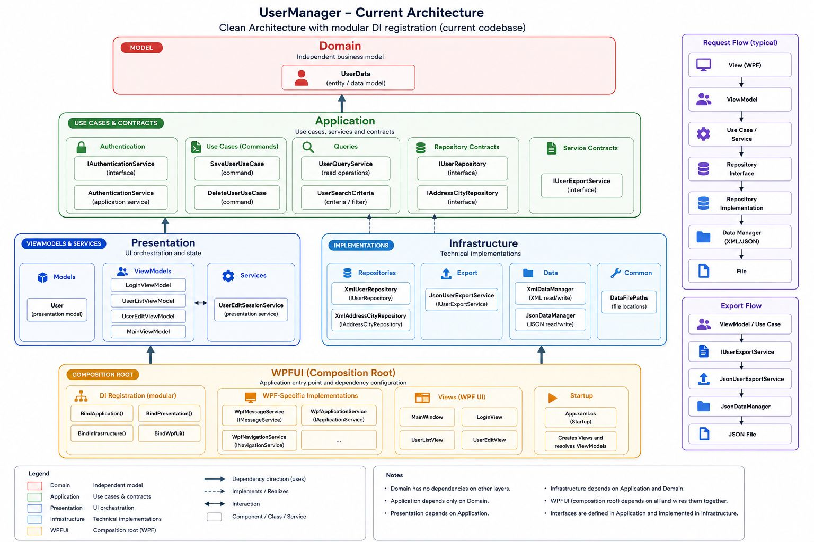

# Architektúra

[Dokumentációs index](README.md) · [English version](../en/architecture.md)

A UserManager Clean Architecture és MVVM elvekből kiinduló layered architecture-t használ, miközben tudatosan kerüli a szükségtelen bonyolítást. Minden rétegnek egyértelmű felelőssége van, és csak jól definiált contractokon keresztül kommunikál.

## Architekturális célok

- A felelősségek tiszta szétválasztása.
- Az üzleti logika legyen független a WPF-től.
- Az üzleti logika legyen független a persistence technológiától.
- Dependency inversion Application contractokon keresztül.
- Vékony ViewModelek, amelyek UI orchestration feladatokat látnak el.
- Az Infrastructure kizárólag technikai implementációkat tartalmazzon.
- Magas testability Dependency Injection és fókuszált service-ek használatával.

## Layered Architecture

Az alkalmazás fő projektjei: `Domain`, `Application`, `Infrastructure`, `Presentation`, `WPFUI`, `Tests`, `FW4di.Dotnet.Core` és `FW4di.Dotnet.MVVM`. A felosztás gyakorlati: elég struktúrát ad a tiszta határok bemutatásához, de nem vezet be felesleges enterprise frameworköt.

A nyilak a fő compile-time project dependencyket mutatják. Nem minden shared framework dependencyt ábrázolnak, és nem a runtime request flow-t jelentik.

## Dependency szabályok

- A Domain nem függhet más projekttől.
- Az Application üzleti kódja csak a Domaintől függhet. A dependency registration entry point emellett a `FW4di.Dotnet.Core` DI abstractiont használja.
- A Presentation az Applicationt, a Domaint és a `FW4di.Dotnet.MVVM` modult használhatja; registration célra a `FW4di.Dotnet.Core` is megengedett.
- Az Infrastructure az Application és Domain rétegektől függhet, technikai helper és registration célra pedig a `FW4di.Dotnet.Core` modultól.
- A WPFUI állítja össze az alkalmazást, ezért hivatkozhat az Application, Presentation, Infrastructure és `FW4di.Dotnet.Core` projektekre.

## Felelősségek szétválasztása

| Réteg | Felelősség |
|---|---|
| `Domain` | Stabil üzleti fogalmak és szabályok. |
| `Application` | Use case-ek, workflow koordináció és a use case-ek contractjai. |
| `Infrastructure` | Konkrét technikai implementációk, például XML repository és JSON export. |
| `Presentation` | ViewModelek, UI state, navigation, session state és presentation mapping. |
| `WPFUI` | WPF Views, XAML, WPF validation, converters, platform adapterek, startup és composition. |
| `FW4di.Dotnet.Core` | Újrahasznosítható Dependency Injection és technikai helperek. |
| `FW4di.Dotnet.MVVM` | Újrahasznosítható MVVM support: commandok, notification és messaging primitívek. |

## Compile-time dependencyk

A jelenlegi project reference-ek:

- `Domain`: `net10.0`, nincs project reference.
- `Application`: `net10.0`, `Domain` és `FW4di.Dotnet.Core` reference.
- `Presentation`: `net10.0`, `Application`, `Domain`, `FW4di.Dotnet.Core`, `FW4di.Dotnet.MVVM` reference.
- `Infrastructure`: `net10.0`, `Application`, `Domain`, `FW4di.Dotnet.Core` reference.
- `WPFUI`: `net10.0-windows`, `Application`, `Presentation`, `Infrastructure`, `FW4di.Dotnet.Core` reference.
- `Tests`: `net10.0`, a tesztelt projekteket referálja.

## Runtime composition

Runtime a WPFUI a Composition Root. Az Application által definiált contractokon keresztül köti össze a Presentation és Infrastructure rétegeket.

Egy tipikus művelet útja: `View -> ViewModel -> Application Use Case -> Domain / Infrastructure`, majd az eredmény Application result, Presentation state, property change notification és WPF binding formájában tér vissza.

## MVVM és Clean Architecture

Az MVVM a user interface-t, presentation state-et és application behaviort választja szét. A layered architecture és Clean Architecture a teljes rendszer felelősségi határait és dependency directionjét rögzíti. A Clean Code és SOLID a modulok, classok, metódusok és contractok belső designját vezeti.

| MVVM szerep | Jelenlegi modulok |
|---|---|
| Model | `Domain`, `Application`, `Infrastructure` |
| ViewModel | `Presentation`, `FW4di.Dotnet.MVVM` támogatással |
| View | `WPFUI` |
| Composition és startup | `WPFUI`, `FW4di.Dotnet.Core` támogatással |
| Verification | `Tests` |

A modulok nem külön-külön valósítanak meg önálló MVVM patternt, hanem együtt adják ki az MVVM role-okat.

Kapcsolódó oldalak: [Modulok és rétegek](modules-and-layers.md), [Dependency Registration](dependency-registration.md), [Runtime Flow](runtime-flow.md).
