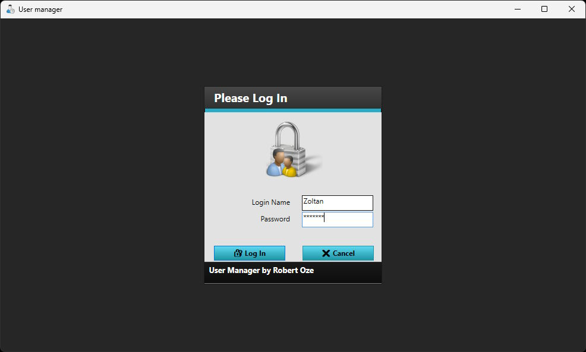
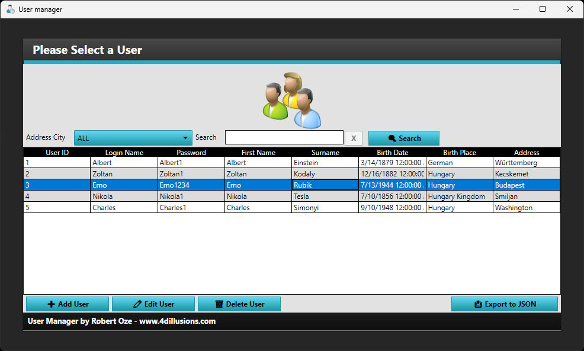
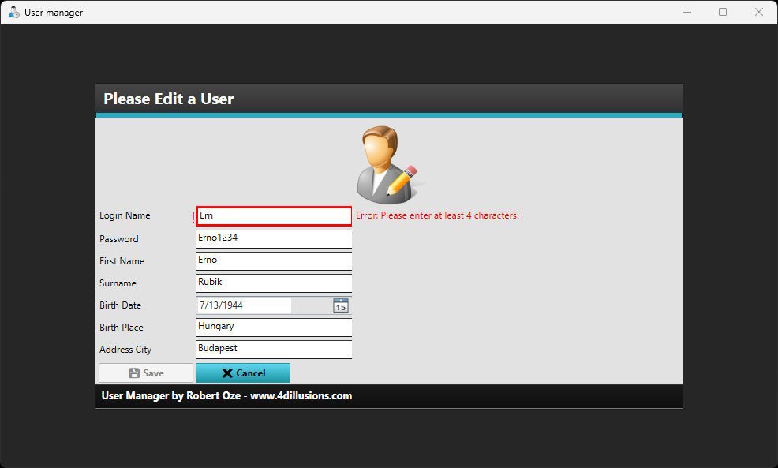
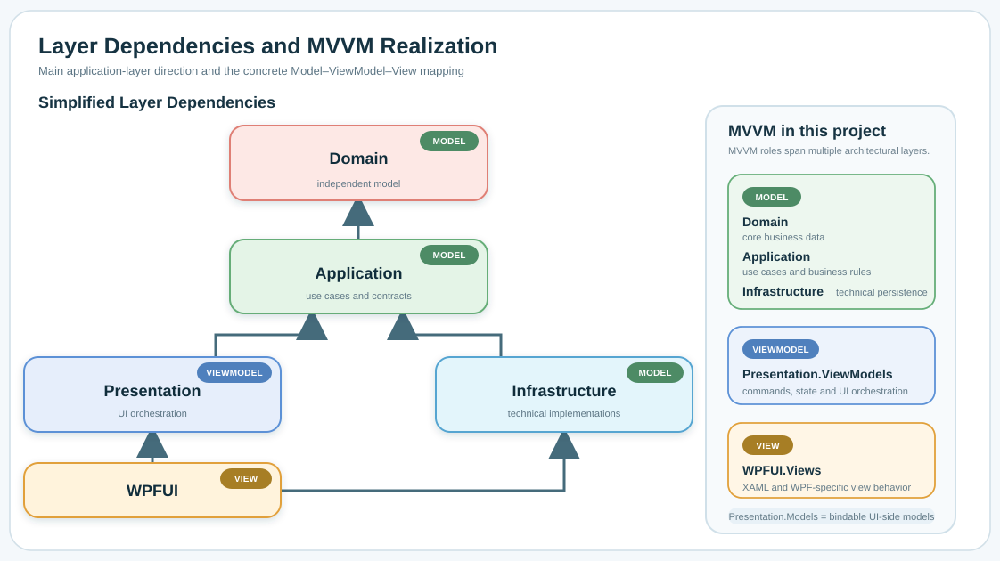

<p align="center">
  
</p>

# UserManager

## Languages

- 🇬🇧 English
- 🇭🇺 [Magyar](README_HU.md)

<p align="center">
  
  
  <a href="https://github.com/4dillusions/UserManager/actions/workflows/dotnet-desktop.yml">
    
  </a>
</p>

A layered WPF sample application demonstrating modern MVVM architecture, dependency injection, repository pattern, application use cases, and clean separation between presentation, business logic, and persistence.

The repository is also a reusable technical reference for WPF, MVVM, layered architecture, and Clean Architecture-inspired design.

## Screenshots

<p align="center"></p>
<p align="center"></p>
<p align="center"></p>

## Overview

UserManager is a small WPF application capable of user authentication, user management, XML persistence, and JSON export.

The application contains three screens:

1. **Login** - authenticates a user against the XML data file.
2. **User List** - displays users, filters by city, searches user data, adds, edits, deletes, and exports users.
3. **User Editor** - edits every field except `UserId`, shows input validation, and uses a transactional Save / Cancel workflow.

## Main Features

- Layered architecture.
- MVVM pattern.
- Dependency Injection.
- Repository pattern.
- Application Use Cases.
- Transactional Edit Session.
- XML persistence.
- Atomic JSON export.
- Separation of Presentation, Business Logic and Persistence.
- Unit tests across Domain, Application, Presentation, Infrastructure, and dependency registration behavior.

## Architecture Summary

The project follows a layered architecture inspired by Clean Architecture and MVVM principles while intentionally avoiding unnecessary complexity. Each layer has a single responsibility and communicates through well-defined contracts.

<p align="center"></p>

The simplified dependency rules are:

- `Domain` depends on no other UserManager project.
- `Application` depends on `Domain` and owns use cases and contracts.
- `Presentation` depends on `Application`, `Domain`, and shared MVVM support.
- `Infrastructure` implements `Application` contracts and depends on `Application` and `Domain`.
- `WPFUI` is the Composition Root and wires the concrete application together.
- `FW4di.Dotnet.Core` and `FW4di.Dotnet.MVVM` remain reusable technical framework modules.

Detailed architecture documentation is available in [Doc/architecture.md](Doc/architecture.md).

## Project Structure

```text
UserManager
├── README.md
├── README_HU.md
├── Doc/
│   ├── images/
│   ├── architecture.md
│   ├── architecture_HU.md
│   ├── cookbook/
│   └── decisions/
└── Project/
    ├── App4di.Dotnet.UserManager.Domain/
    ├── App4di.Dotnet.UserManager.Application/
    ├── App4di.Dotnet.UserManager.Infrastructure/
    ├── App4di.Dotnet.UserManager.Presentation/
    ├── App4di.Dotnet.UserManager.WPFUI/
    ├── App4di.Dotnet.UserManager.Tests/
    └── FirstParty/
```

For a detailed explanation of every architectural module and layer, see [Doc/architecture.md](Doc/architecture.md).

## Clone

```bash
git clone --recurse-submodules https://github.com/4dillusions/UserManager.git
git submodule update --init --recursive
git submodule update --remote --merge
```

## Build and Run

The application targets `.NET 10.0` and the WPF UI targets `net10.0-windows`.

Open the solution from:

```text
Project/App4di.Dotnet.UserManager.Windows.slnx
```

Build from the command line:

```bash
dotnet build Project/App4di.Dotnet.UserManager.Windows.slnx
```

Run the WPF application from Visual Studio or another Windows/.NET desktop capable IDE by selecting the `App4di.Dotnet.UserManager.WPFUI` project.

The application data file is stored under `Project/Data/data.xml`.

## Tests

```bash
dotnet test Project/App4di.Dotnet.UserManager.Windows.slnx
```

Current tests cover Domain, Application, Presentation, Infrastructure, dependency registration, repository behavior, export behavior, navigation, sessions, and ViewModels.

## Documentation

- [🇬🇧 Architecture handbook](Doc/architecture.md) / [🇭🇺 Architektúra kézikönyv](Doc/architecture_HU.md)
- [🇬🇧 Cookbook](Doc/cookbook/README.md) / [🇭🇺 Receptgyűjtemény](Doc/cookbook/README_HU.md)
- [🇬🇧 Architecture Decision Records](Doc/decisions/README.md) / [🇭🇺 Architekturális döntési napló](Doc/decisions/README_HU.md)

## License

The source files state that the project is released under the GNU General Public License version 3 or later.
