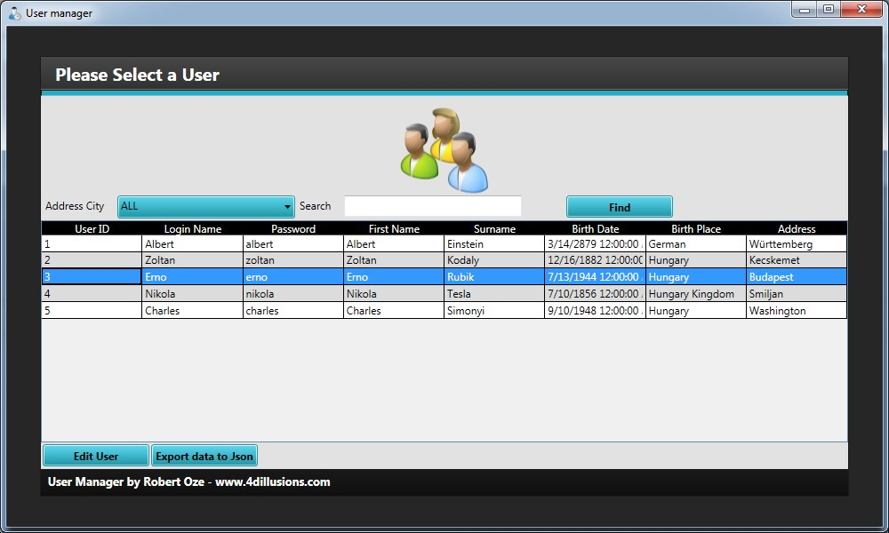

User Manager (senior C#/.NET interview test) 
============================================

Create a WPF application what can do
------------------------------------
-create three views for user management  
-user data: UserId, LoginName, Password, Surname, FirstName, BirthDate, BirthPlace, AddressCity  
-store data in file  
1. Login view: user/password (check it in file)  
2. User list view: users in grid, filter options: city combo box, search box with word searching in all data, "edit" button for 3rd view  
3. User detail view: user list item in new window, edit all data except UserId, data validation, save/cancel buttons, back to 2nd view after save data to file (refresh user list)  
-bonus: XML export from grid (or JSON export if the file stored in XML)  
&ensp;	what is json: https://en.wikipedia.org/wiki/JSON  

Helper libraries
----------------
Json.NET: http://www.newtonsoft.com/json
