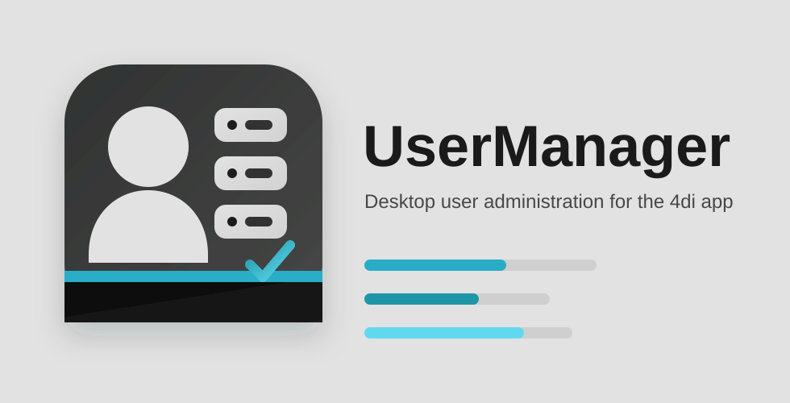
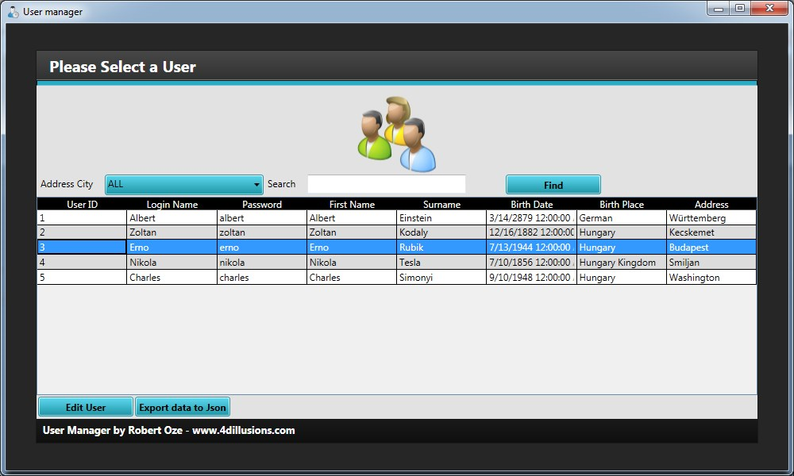
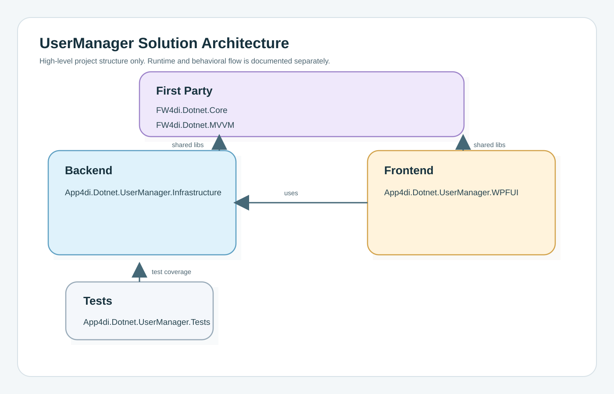
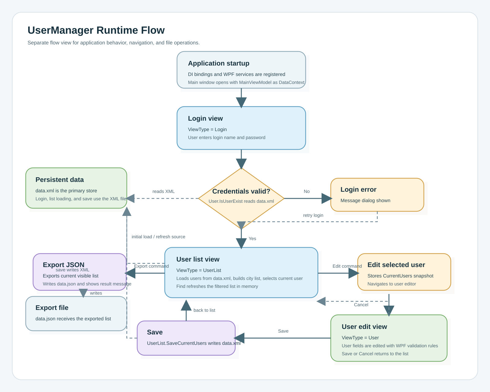

<p align="center">
  
</p>

<p align="center">
  
  
  <a href="https://github.com/4dillusions/UserManager/actions/workflows/dotnet-desktop.yml">
    
  </a>
</p>

<p align="center">
  
</p>

## 📥 Clone
Clone the entire project including the submodules:<br>
```bash
git clone --recurse-submodules https://github.com/4dillusions/UserManager.git
```

If the project is already cloned and you forgot to fetch the submodules:<br>
```bash
git submodule update --init --recursive
```

If the submodules have been updated and you want to fetch the latest changes:<br>
```bash
git submodule update --remote --merge
```

## 📋 Overview
Create a WPF application what can do
- create three views for user management <br/>
- user data: UserId, LoginName, Password, Surname, FirstName, BirthDate, BirthPlace, AddressCity <br/>
- store data in file <br/>

1. Login view: user/password (check it in file) <br/>
2. User list view: users in grid, filter options: city combo box, search box with word searching in all data, "edit" button for 3rd view <br/>
3. User detail view: user list item in new window, edit all data except UserId, data validation, save/cancel buttons, back to 2nd view after save data to file (refresh user list) <br/>
-bonus: XML export from grid (or JSON export if the file stored in XML) <br/>
&ensp;	what is json: https://en.wikipedia.org/wiki/JSON <br/>

## 🏗️ Architecture and flow

### Modules and Layers

#### FW4di.Dotnet.Core

A shared technical foundation layer. It contains general-purpose helper functionality, dependency injection support, and other application-agnostic infrastructure components.

In a larger application, this module could also contain additional shared technical elements, such as configuration helpers, basic lifecycle management, simple utility classes, or framework-level components that are not tied to a specific business domain.

#### FW4di.Dotnet.MVVM

Provides the shared building blocks required by the MVVM pattern. These include commands, property-change notifications, binding support, and simple messaging primitives.

In a larger application, this module could also contain additional MVVM infrastructure, such as validation foundations, ViewModel base classes, UI message bus implementations, or general navigation abstractions. It is important that this layer remains free of concrete business logic.

#### Domain

The application's business and data model layer. In the current project, it mainly contains the clean `UserData` model, which does not depend on the UI, persistence, or any concrete technology implementation.

In a larger application, the Domain layer would contain more than data models. It could include business entities, value objects, domain rules, invariants, domain services, specifications, and other business concepts that describe the application's essential behavior. This layer defines the concepts used by the system and the business rules that apply to them.

#### Application

Contains the application's use cases and contracts. It currently includes authentication, user search, export, save operations, and repository interfaces.

In a larger application, this layer would contain use cases, command and query handlers, application-level workflows, transaction boundaries, ports, and service contracts. It does not define how XML is written or how files are accessed. Instead, it defines which operations the application supports, such as saving, searching, and exporting users, checking permissions, or executing more complex workflows.

#### Infrastructure

The layer containing concrete technical implementations. It currently contains the XML repositories, data manager classes, file paths, and the concrete JSON export implementation.

In a larger application, this layer would contain the concrete implementation of every external technology dependency: database access, file-system operations, web API clients, email delivery, logging, caching, background processes, external service integrations, and other platform-dependent technical adapters. This layer implements the interfaces defined by the Application layer.

#### Presentation

The layer containing application-specific presentation logic. It includes ViewModels, bindable models, navigation abstractions, UI session state, mapping, and edit-session management.

In a larger application, this layer would contain screen state, commands, UI-specific models, form state, validation adapters, and the connection between user actions and Application use cases. The Presentation layer exposes data and operations in a form convenient for the UI, but it must not contain persistence or infrastructure logic.

#### WPFUI

The concrete WPF application layer. It contains Views, XAML files, converters, WPF-specific validation, platform adapters, and the dependency injection composition root.

In a larger application, this layer would contain all WPF-specific implementations: windows, pages, resource dictionaries, control templates, platform-dependent dialogs, application startup, theme management, and concrete View-to-ViewModel wiring. At runtime, this layer connects the Presentation layer to the Infrastructure implementations.

#### Tests

The test project verifies the behavior of the system's layers. Separate tests currently cover the important parts of the Domain, Application, Presentation, and Infrastructure layers.

In a larger application, testing would be divided into multiple levels: unit tests, integration tests, architectural dependency tests, and potentially UI or end-to-end tests. The goal is to keep each layer independently verifiable and to ensure that later changes do not silently violate the architectural boundaries.

<p align="center">
  
</p>
<p align="center">
  
</p>
