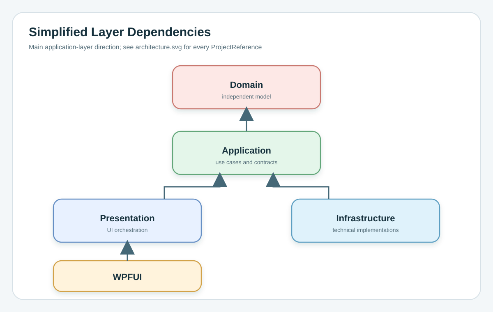

<p align="center">
  
</p>

<p align="center">
  
  
  <a href="https://github.com/4dillusions/UserManager/actions/workflows/dotnet-desktop.yml">
    
  </a>
</p>

<p align="center">
  
</p>

# UserManager

A layered WPF sample application demonstrating modern MVVM architecture, dependency injection, repository pattern, application use cases, and clean separation between presentation, business logic, and persistence.

---

# 📥 Clone

Clone the entire project including the submodules:

```bash
git clone --recurse-submodules https://github.com/4dillusions/UserManager.git
```

If the project is already cloned and you forgot to fetch the submodules:

```bash
git submodule update --init --recursive
```

If the submodules have been updated and you want to fetch the latest changes:

```bash
git submodule update --remote --merge
```

---

# 📋 Overview

Create a WPF application capable of:

* User authentication
* User management
* XML persistence
* JSON export

The application contains three screens:

1. **Login**

   * Authenticate a user against the XML database.

2. **User List**

   * Display all users.
   * Filter by city.
   * Search user data.
   * Open the editor.

3. **User Editor**

   * Edit every field except `UserId`.
   * Input validation.
   * Transactional Save / Cancel workflow.

Additional feature:

* JSON export of the currently displayed user list.

---

# ✨ Highlights

* Layered architecture
* MVVM pattern
* Dependency Injection
* Repository pattern
* Application Use Cases
* Transactional Edit Session
* Atomic JSON export
* XML persistence
* JSON export
* Separation of Presentation, Business Logic and Persistence
* Comprehensive unit test coverage

---

# 🏗️ Architecture

The project follows a layered architecture inspired by Clean Architecture and MVVM principles while intentionally avoiding unnecessary complexity.

Each layer has a single responsibility and communicates only through well-defined contracts.

---

## Architectural Principles

The main architectural goals are:

* Clear separation of responsibilities.
* Business logic independent from WPF.
* Business logic independent from persistence.
* Dependency inversion through Application contracts.
* Thin ViewModels responsible only for UI orchestration.
* Infrastructure containing only technical implementations.
* High testability through dependency injection and focused services.

---

## Dependencies

The following project dependencies must always be preserved:

<p align="center">
  
</p>

The arrows represent project dependencies. They describe which projects may reference each other at compile time, not how requests flow through the application at runtime.

### Runtime Flow

At runtime, the WPFUI project acts as the composition root. It wires together the Presentation and Infrastructure layers through the contracts defined by the Application layer.

A typical request flows through the system as follows:

<p align="center">
  
</p>

The Application layer coordinates the use case, operates on Domain models, and delegates persistence to the Infrastructure layer through the contracts it defines.


Rules:

- Domain must not depend on any other project.
- Application may depend only on Domain.
- Presentation may depend only on Application and Domain.
- Infrastructure may depend only on Application and Domain.
- WPFUI composes the application and connects Presentation with Infrastructure at runtime.

Rules:

* Domain must not depend on any other project.
* Application may depend only on Domain.
* Presentation may depend only on Application and Domain.
* Infrastructure may depend only on Application and Domain.
* WPFUI composes the application and connects Presentation with Infrastructure.

---

## Design Guidelines

When extending the application:

* Do not place business logic inside ViewModels.
* Do not access repositories directly from Presentation.
* Do not perform XML, JSON or file operations from ViewModels.
* Keep Infrastructure free from UI dependencies.
* Keep Domain independent from framework-specific code whenever practical.
* Prefer introducing new Application use cases instead of growing ViewModels.
* Add unit tests whenever business behavior changes.
* Preserve the dependency direction between layers.

---

# Modules and Layers

Although this sample application is intentionally small, every module has been designed to scale to larger applications.

The descriptions below explain both the current responsibility and the intended purpose of each layer.

---

## FW4di.Dotnet.Core

Shared technical foundation layer.

Provides general-purpose infrastructure such as:

* Dependency Injection support
* Common helper utilities
* Framework-independent technical components

In larger applications this module may also contain configuration helpers, lifecycle management, reusable utilities and other shared infrastructure.

---

## FW4di.Dotnet.MVVM

Provides the reusable infrastructure required by the MVVM pattern.

Current responsibilities include:

* Commands
* Property change notification
* Binding support
* Messaging primitives

In larger applications it may also include validation foundations, ViewModel base classes, UI message buses and general MVVM infrastructure.

This layer intentionally contains **no business logic**.

---

## Domain

Contains the application's business model.

Currently this project contains the `UserData` model.

The Domain layer is independent from:

* WPF
* Presentation
* Infrastructure
* XML
* JSON

In larger applications this layer would additionally contain:

* Business entities
* Value Objects
* Domain Services
* Specifications
* Business Rules
* Invariants
* Domain Policies

The Domain layer describes **what the system is**.

---

## Application

Contains the application's use cases and contracts.

Current responsibilities include:

* Authentication
* User queries
* User export
* Transactional save use case
* Repository contracts
* Service contracts

This layer coordinates application workflows but never performs persistence itself.

It defines **what the application can do**, not **how it is implemented**.

In larger applications this layer would also contain:

* Command handlers
* Query handlers
* Transaction boundaries
* Workflow orchestration
* Permission checks
* Application services
* Ports for external systems

---

## Infrastructure

Contains concrete technical implementations.

Current responsibilities include:

* XML repositories
* JSON export
* Data managers
* File path handling
* File system access

This layer implements the interfaces defined by the Application layer.

In larger applications it could additionally contain:

* Database access
* Web API clients
* Logging
* Caching
* Email delivery
* Background jobs
* External integrations
* Platform-specific adapters

---

## Presentation

Contains all application-specific presentation logic.

Current responsibilities include:

* ViewModels
* Bindable models
* Navigation
* UI session state
* Edit session management
* Mapping between UI models and domain models

The Presentation layer exposes data in a form suitable for the UI while remaining independent from persistence.

ViewModels are responsible only for:

* UI state
* User interaction
* Calling Application use cases

They must not contain business logic or direct infrastructure access.

In larger applications this layer may also include form state, UI validation adapters and additional presentation models.

---

## WPFUI

Contains the concrete WPF implementation.

Responsibilities include:

* Views
* XAML
* WPF validation
* Converters
* Platform services
* Composition Root
* Dependency Injection wiring

This layer contains only WPF-specific code and connects the Presentation layer with the Infrastructure implementations.

---

## Tests

Verifies each architectural layer independently.

Current coverage includes:

* Domain
* Application
* Presentation
* Infrastructure

The test suite verifies:

* Authentication
* User queries
* Save workflow
* Edit session
* Navigation
* Export
* Mapping
* Repository behavior

In larger applications the test suite may also include:

* Integration tests
* Architecture dependency tests
* UI tests
* End-to-end tests

---

<p align="center">
  
</p>

<p align="center">
  The diagram above illustrates the dependency relationships between the architectural layers.
</p>

<p align="center">
  
</p>

<p align="center">
  The diagram above illustrates the application's runtime workflow.
</p>
